# 🔐 CipherChat — Enterprise-Grade E2E Pixel Encrypted Messaging


**CipherChat** is a state-of-the-art, real-time messaging platform that redefines secure communication through a unique **multi-layered pixel-based cryptographic pipeline**. Unlike traditional chat apps that treat messages as mere strings, CipherChat treats everything as highly-available visual data, offering a secure, stateless, and visually verifiable encryption experience.

---

## 🛠️ The Cryptographic Pipeline

CipherChat utilizes a proprietary "Purity to Pixel" (P2P) engine that runs every payload through a rigorous multi-stage security process before it ever leaves the client's device.

### 🛡️ Layer 1: Elliptic Curve Diffie-Hellman (ECDH)
Before any data is exchanged, users undergo an ECDH (NIST P-256) handshake to derive a shared secret. This secret is used to generate ephemeral AES-GCM and HMAC keys that never touch the server's memory.

### 🖼️ Layer 2: Visual XOR Purity (XOR-VP)
The core message data is converted into a high-density 32-bit pixel array. This array is XOR-encrypted against a dynamically generated **Key Image**, effectively obfuscating the data at the visual layer even before symmetric encryption.

### 🗝️ Layer 3: AES-256-GCM + HMAC-SHA256
The XORed payload is then wrapped in an **AES-256-GCM** envelope for authenticated encryption. Finally, a unique **HMAC-SHA256** signature is appended to ensure message integrity and sender authenticity.

```mermaid
graph LR
    A[Plaintext/Media] --> B[Pixel Conversion]
    B --> C[XOR Key Overlay]
    C --> D[AES-256-GCM]
    D --> E[HMAC-SHA256 Signing]
    E --> F[Socket Relay]
    F --> G[Recipient Client]
    G --> H[HMAC Verify]
    H --> I[AES Decrypt]
    I --> J[XOR Key Overlay]
    J --> K[Reformatted Media]
```



---

## ✨ Features that Define Security

- **Zero-Knowledge Architecture:** The server operates as a stateless relay. It never stores messages, never holds keys, and has zero visibility into the contents of the pixel data.
- **Interactive Encryption Pipeline:** A live developer sidebar visualizes the encryption flow, showing the raw message data, the cryptographic key image, and the resulting cipher-pixel array in real-time.
- **E2E Media Optimization:** Support for high-fidelity images (**JPEG, PNG, GIF, WebP**) and voice recordings, all processed through the same visual pipeline.
- **Developer Ecosystem:** 
  - **Live Dashboard:** Monitor session health and peer connection status at `/dev`.
  - **History API:** Programmatic access to session metadata via `/api/history`.
- **Modern UX:** Glassmorphism UI, real-time typing indicators, read receipts, and verified message badges (✅).

---

## 🚀 Quick Start

### Installation

1.  **Clone the repository:**
    ```bash
    git clone https://github.com/GJ842/CipherChat.git
    cd CipherChat
    ```
2.  **Install dependencies:**
    ```bash
    npm install
    ```
3.  **Start the secure server:**
    ```bash
    npm run dev
    ```

### Usage Requirements

> [!WARNING]
> Since CipherChat utilizes the **Web Crypto API** for browser-side encryption and the **MediaDevices API** for voice recording, it **MUST** be served over `localhost` or a secure `HTTPS` context.

---

## 🏗️ Technical Stack

- **Frontend**: 
  - **Core Logic**: Vanilla JavaScript (ES6+) with zero external frontend dependencies.
  - **Styling**: Modern CSS3 with **Glassmorphism**, Flexbox, and CSS Grid.
  - **Graphics**: HTML5 Canvas API for pixel-level data manipulation.
- **Backend**:
  - **Engine**: Node.js & Express.
  - **Real-Time Layer**: Socket.IO for low-latency message relay.
- **Security Protocols**:
  - **Key Exchange**: ECDH (P-256).
  - **Encryption**: AES-256-GCM, XOR Visual Steganography.
  - **Integrity**: HMAC-SHA256.

---

## 🔒 Security Policy & Limitations

CipherChat is currently optimized for **1-to-1 secure sessions** to ensure the highest integrity of the ECDH handshake. 

**Current Data Restrictions:**
- **Images Only:** To maintain the performance of the visual XOR pipeline, file sharing is currently restricted to image formats (JPEG, PNG, GIF, WebP, etc.). Videos and documents are rejected to preserve the visual integrity of the pixel buffer.

---

## 📄 License & Attribution

CipherChat is an open-source project designed for educational and professional secure-comms research. 

*Designed and Developed for maximum transparency and extreme privacy.*
